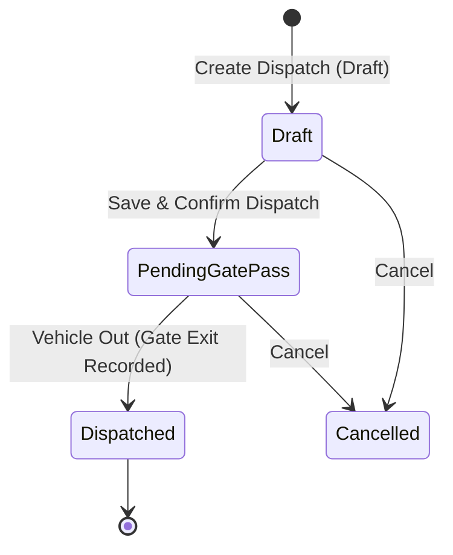

# Stock Dispatch / Sales Outward Module - Implementation Plan

This document outlines the system design, database table schemas, business logic flows, and gate exit integration for the **Stock Dispatch / Sales Outward** module.

---

## User Review Required

Please review the proposed database fields, statuses, and flow. The key design decisions include:
1. **Tenancy and Scoping:** The dispatch belongs to a specific `warehouse_id` and `branch_id`, and lists will filter based on the logged-in user's scope (`isGlobal()`, `isBranchScoped()`, `isWarehouseScoped()`).
2. **Gate Exit Integration:** Dispatches can be linked to `vehicle_logs` where `log_type` is `stock_out`. Recording an exit on the vehicle log will automatically transition the dispatch to `dispatched` and record the exit timestamp.
3. **Bag-Level vs. Batch-Level Dispatches:** Dispatches are logged as a master record (`stock_dispatches`) with line items referencing specific bags (`dispatch_items`). 
4. **Validation:** Bags must be in the `in_stock` status to be dispatched. During dispatch, their status changes to `dispatched`, and their `selling_price` and `total_sales_amount` are updated.

---

## Proposed Database Architecture

We will introduce two new tables: `stock_dispatches` and `dispatch_items`.

### 1. `stock_dispatches`
Tracks the dispatch master record including customer details, gate pass reference, invoice numbers, and vehicle association.

| Field Name | Type | Constraints | Description |
| :--- | :--- | :--- | :--- |
| `id` | BigInt | PK, Auto Increment | Unique Identifier |
| `dispatch_number` | String(50) | Unique | Auto-generated sequential format (e.g., `DSP-YYYYMMDD-0001`) |
| `warehouse_id` | Foreign Key | Constrained (`warehouses.id`) | Origin warehouse from which stock is dispatched |
| `branch_id` | Foreign Key | Constrained (`branches.id`) | Tenant branch tracking |
| `dispatch_type` | Enum | `['sales', 'customer_delivery', 'processing', 'transfer']` | Purpose of the dispatch |
| `dispatch_date` | Date | Not Null | Date of dispatch |
| `buyer_name` | String(255) | Nullable | Name of buyer / customer |
| `buyer_phone` | String(20) | Nullable | Contact number of the buyer |
| `delivery_note_reference`| String(100) | Nullable | Delivery note / waybill number |
| `invoice_reference` | String(100) | Nullable | Invoice number |
| `vehicle_id` | Foreign Key | Constrained (`vehicles.id`), Nullable | Transport vehicle details |
| `vehicle_log_id` | Foreign Key | Constrained (`vehicle_logs.id`), Nullable | Links to gate control log (type: `stock_out`) |
| `total_bags` | Integer | Not Null, Default `0` | Total bags included in the dispatch |
| `total_weight` | Decimal(10,2) | Not Null, Default `0.00` | Cumulative net weight of all dispatched bags |
| `total_sales_amount` | Decimal(15,2) | Not Null, Default `0.00` | Sum of selling prices for all dispatched bags |
| `status` | Enum | `['draft', 'pending_gate_pass', 'dispatched', 'cancelled']` | Dispatch status lifecycle |
| `gate_pass_number` | String(50) | Nullable, Unique | Gate pass identifier for security exit |
| `gate_exit_at` | DateTime | Nullable | Actual timestamp when vehicle exits gate |
| `notes` | Text | Nullable | Internal/external notes |
| `created_by` | Foreign Key | Constrained (`users.id`) | User who initiated the dispatch |
| `updated_by` | Foreign Key | Constrained (`users.id`), Nullable | User who updated the record |
| `created_at` / `updated_at` | Timestamps | - | Laravel audit timestamps |

### 2. `dispatch_items`
Tracks individual bags assigned to a dispatch.

| Field Name | Type | Constraints | Description |
| :--- | :--- | :--- | :--- |
| `id` | BigInt | PK, Auto Increment | Unique Identifier |
| `stock_dispatch_id` | Foreign Key | Constrained (`stock_dispatches.id`), Cascade Delete | Reference to the master dispatch |
| `stock_bag_id` | Foreign Key | Constrained (`stock_bags.id`), Restrict Delete | Reference to the unique bag in stock |
| `selling_price` | Decimal(10,2) | Not Null, Default `0.00` | The final price at which this specific bag was sold |
| `bag_weight` | Decimal(10,2) | Not Null | Snapshotted weight from `stock_bags` at dispatch time |
| `notes` | Text | Nullable | Line-item specific remarks |
| `created_by` | Foreign Key | Constrained (`users.id`) | Creator of this item record |
| `updated_by` | Foreign Key | Constrained (`users.id`), Nullable | Updater of this item record |
| `created_at` / `updated_at` | Timestamps | - | Laravel audit timestamps |

---

## State Transition Logic & Gate Integration

### Business Logic Steps (Database Transaction):
1. **Validation:**
   - Verify that all requested `stock_bag_id`s have `status = 'in_stock'`.
   - Ensure bags belong to the origin `warehouse_id`.
2. **Stock Bag Updates:**
   - Transition status from `in_stock` to `dispatched`.
   - Update `selling_price` and `total_sales_amount` (i.e. `bag_weight * selling_price`) on the `stock_bags` table.
3. **Dispatch Totals Calculation:**
   - Calculate cumulative metrics (`total_bags`, `total_weight`, `total_sales_amount`) automatically from line-item weights and prices if not explicitly provided.
4. **Gate Exit Integration:**
   - When a dispatch is confirmed, create/assign a `VehicleLog` of `log_type = 'stock_out'` and `direction = 'in'`.
   - When the security guard records the vehicle's gate exit (using the existing vehicle log exit mechanism), the system triggers a listener/hook to:
     - Update `stock_dispatches.status` to `dispatched`.
     - Update `stock_dispatches.gate_exit_at = now()`.

---

## Proposed Changes

### Database Layer
#### [NEW] [2026_07_23_100000_create_stock_dispatches_table.php](file:///c:/laragon/www/cdp-warehouse-api/database/migrations/2026_07_23_100000_create_stock_dispatches_table.php)
Migration file defining `stock_dispatches` and `dispatch_items`.

### Models Layer
#### [NEW] [StockDispatch.php](file:///c:/laragon/www/cdp-warehouse-api/app/Models/StockDispatch.php)
Laravel Model mapping the master dispatch table. Contains:
- Relationships: `warehouse`, `branch`, `vehicle`, `vehicleLog`, `items`, `creator`.
- Sequential dispatch number auto-generation (e.g. `DSP-20260722-0001`).
- Custom search scope.

#### [NEW] [DispatchItem.php](file:///c:/laragon/www/cdp-warehouse-api/app/Models/DispatchItem.php)
Laravel Model mapping dispatch items. Contains:
- Relationships: `dispatch`, `stockBag`, `creator`.

#### [MODIFY] [StockBag.php](file:///c:/laragon/www/cdp-warehouse-api/app/Models/StockBag.php)
Add relationships to `dispatchItem`.

### Http & Request Layer
#### [NEW] [CreateStockDispatchRequest.php](file:///c:/laragon/www/cdp-warehouse-api/app/Http/Requests/CreateStockDispatchRequest.php)
Validation rules for creating a dispatch (validates customer info, item arrays, weights, and bag statuses).

#### [NEW] [UpdateStockDispatchRequest.php](file:///c:/laragon/www/cdp-warehouse-api/app/Http/Requests/UpdateStockDispatchRequest.php)
Validation rules for updates (e.g., editing draft details).

#### [NEW] [StockDispatchController.php](file:///c:/laragon/www/cdp-warehouse-api/app/Http/Controllers/V1/StockDispatchController.php)
Handles REST API CRUD endpoints:
- `index`: Paginated list of dispatches filtered by user warehouse scope.
- `store`: Implements DB transactions for validating bags, creating dispatches, and modifying bag statuses.
- `show`: Detailed dispatch layout with item breakdowns.
- `update`: Modifications (draft only).
- `destroy`: Roll back bag status (back to `in_stock`) if dispatch is deleted/cancelled in draft.
- `confirmGatePass`: Transition status to `pending_gate_pass` and assign/generate gate pass numbers.

### Routes & Security
#### [MODIFY] [v1.php](file:///c:/laragon/www/cdp-warehouse-api/routes/v1.php)
Add `/stock-dispatches` resource routes.

#### [MODIFY] [PermissionsSeeder.php](file:///c:/laragon/www/cdp-warehouse-api/database/seeders/PermissionsSeeder.php)
Add permissions:
- `StockDispatch Index`
- `StockDispatch Create`
- `StockDispatch View`
- `StockDispatch Update`
- `StockDispatch Delete`
- `StockDispatch Exit Integration`

---

## Verification Plan

### Automated Tests
We will add manual and integration test scripts or run Laravel test scenarios:
- **Unit/Integration Test:** Propose database seeding test for status check and transaction validation (e.g., attempting to dispatch a bag already marked `dispatched` or `damaged` should throw a 422 error).

### Manual Verification
1. **Creation:** Create a draft dispatch specifying 3 `in_stock` bags, verify dispatch is in `draft` and bag status remains `in_stock`.
2. **Confirmation:** Confirm the dispatch, verify status changes to `pending_gate_pass`, gate pass number is generated, and bag status changes to `dispatched` with the specified selling price updated.
3. **Exit Hook:** Perform exit on the linked `VehicleLog` and verify dispatch status updates to `dispatched` with a valid exit timestamp.
